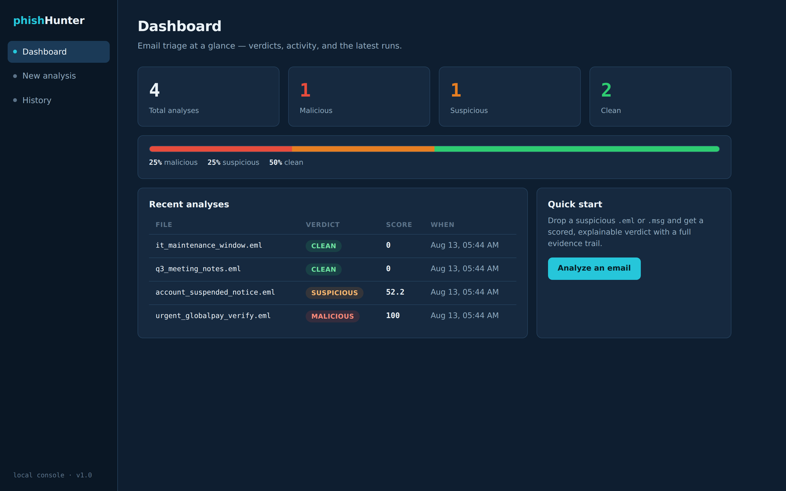
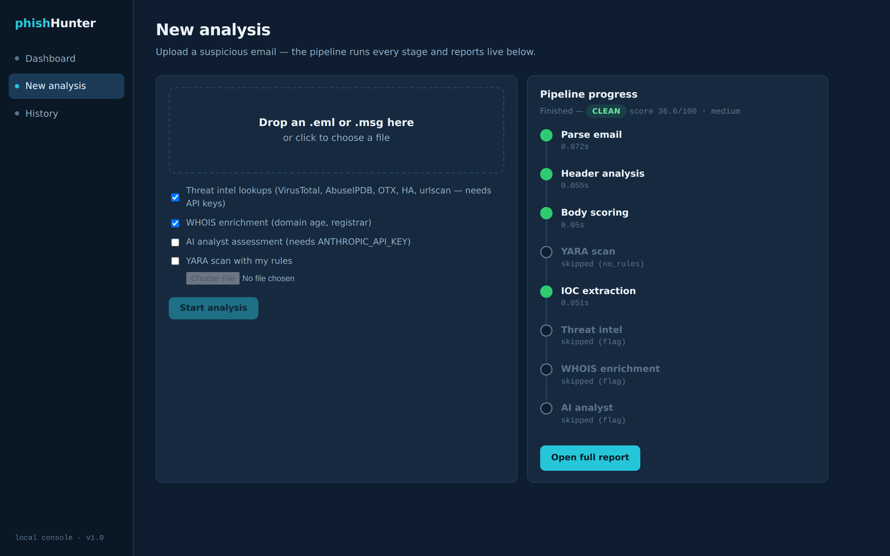
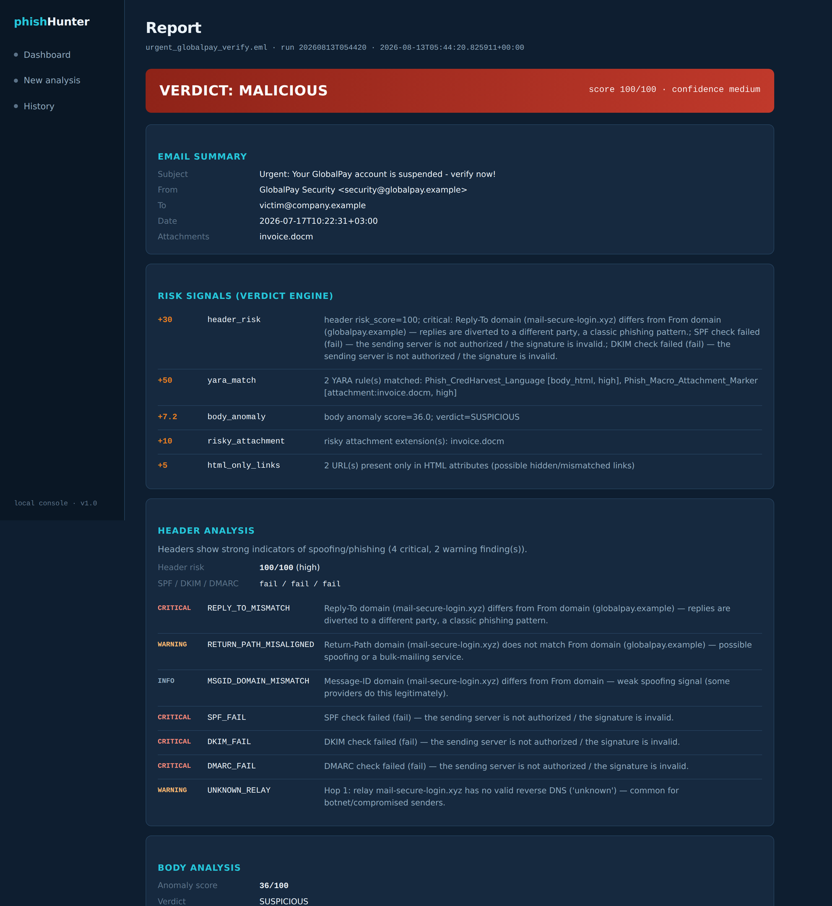
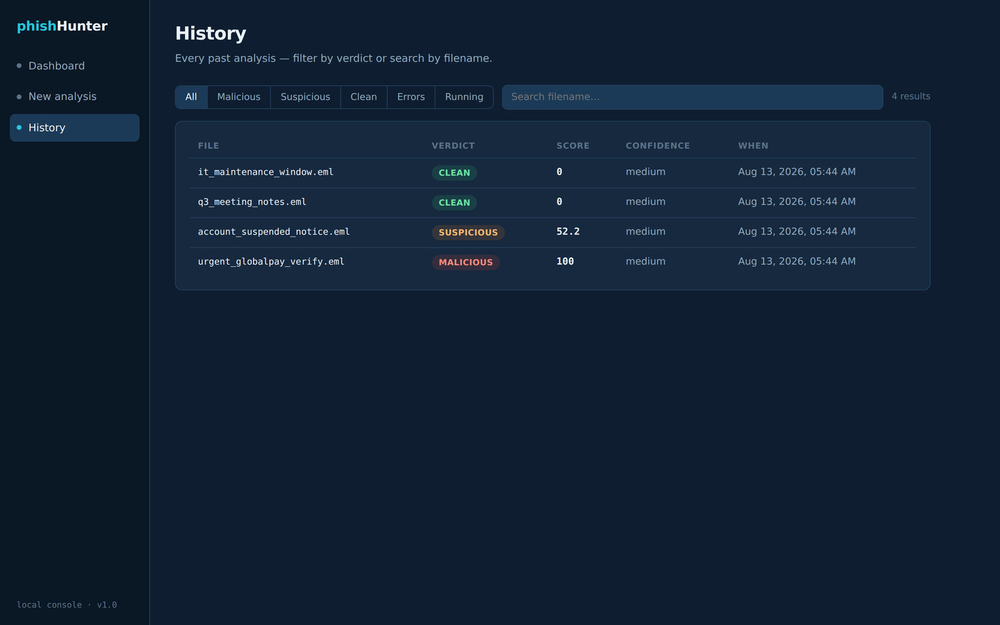

# 🎣 phishHunter — Email Security AI Triage Toolkit

**AI-assisted, end-to-end email threat analysis — a modular pipeline that runs from the command line, as [Claude Agent Skills](https://docs.claude.com/en/docs/agents-and-tools/agent-skills), or from a local web console.**


Give it a suspicious `.eml` or `.msg` file — get back a full SOC-style investigation and a weighted **malicious / suspicious / clean** verdict, with every signal explained.



---

## 🏗 Architecture

```
                                    .eml / .msg
                                         │
                                         ▼
                              ┌─────────────────────┐
                              │  1. email-parser    │  structured JSON
                              └──────────┬──────────┘  (headers, body, attachments)
          ┌──────────────────┬──────────┼──────────┬──────────────────┐
          ▼                  ▼          ▼           ▼                  ▼
 ┌────────────────┐ ┌────────────────┐  │  ┌────────────────┐ ┌────────────────────┐
 │ 2. email-      │ │ 3. email-      │  │  │ ✦ email-yara-  │ │ 4. ioc-extractor   │
 │    header-     │ │    anomaly-    │  │  │    scanner     │ │  IPs · domains     │
 │    analyzer    │ │    detector    │  │  │  (optional,    │ │  URLs · hashes     │
 │ SPF/DKIM/DMARC │ │ spam score,    │  │  │  --yara-rules) │ │  attachment SHA256 │
 │ spoofing,      │ │ brand          │  │  │ your rules vs. │ │                    │
 │ routing        │ │ impersonation  │  │  │ every layer    │ │                    │
 └───────┬────────┘ └───────┬────────┘  │  └───────┬────────┘ └─────────┬──────────┘
         │                  │           │          │          ┌─────────┴─────────┐
         │                  │           │          │          ▼                   ▼
         │                  │           │          │  ┌────────────────┐ ┌──────────────┐
         │                  │           │          │  │ 5. ioc-        │ │ 6. whois-    │
         │                  │           │          │  │  orchestrator  │ │    lookup    │
         │                  │           │          │  │ VirusTotal ·   │ │ registrar,   │
         │                  │           │          │  │ AbuseIPDB ·    │ │ DOMAIN AGE,  │
         │                  │           │          │  │ OTX · Hybrid · │ │ IP owner     │
         │                  │           │          │  │ urlscan ∥      │ │              │
         │                  │           │          │  └───────┬────────┘ └──────┬───────┘
         └──────────────────┴───────────┴──────────┴──────────┴─────────────────┘
                                         │
                                         ▼
                              ┌─────────────────────┐
                              │  7. VERDICT ENGINE  │  weighted 0–100 score
                              │  malicious /        │  + explained signals
                              │  suspicious / clean │  (YARA hit = strong signal)
                              └──────────┬──────────┘
                                         ▼  (optional --ai)
                              ┌─────────────────────┐
                              │  8. LLM Analyst     │  Anthropic API assessment
                              │     Assessment      │  + recommended actions
                              └──────────┬──────────┘
                                         ▼  (optional)
                              ┌─────────────────────┐
                              │  9. PDF Report      │  color-coded, shareable
                              │     Generator       │  analyst deliverable
                              └─────────────────────┘

   ┌───────────────────────────────────────────────────────────────────────────┐
   │  LOGGING & AUDIT TRAIL  —  wraps every stage: start, end, duration,       │
   │  skip-reason, error.  Streamed to stderr and an optional JSON-Lines       │
   │  --log-file (SIEM-ready), with a one-line pipeline_end run summary.       │
   └───────────────────────────────────────────────────────────────────────────┘
```

Stages **2, 3, ✦ (YARA), and 4** run off the parsed email; **5 & 6** enrich
the IOCs that stage 4 extracts. The **✦ YARA** stage is optional — it only
runs when you pass `--yara-rules` — and a rule match feeds the verdict engine
as one of its strongest signals.

Every stage is **fail-soft**: missing API keys, no network, or an absent skill never aborts the run — the report records what was skipped and the verdict confidence is lowered accordingly.

---

## 📦 Skills in this repository

| Skill | Role in pipeline | Network | External deps |
|---|---|---|---|
| [`email-triage-pipeline`](skills/email-triage-pipeline) | 🎯 **Master orchestrator + AI verdict** | optional | – |
| [`email-parser`](skills/email-parser) | Parse `.msg` / `.eml` → normalized JSON | no | – |
| [`email-header-analyzer`](skills/email-header-analyzer) | Spoofing, SPF/DKIM/DMARC, Received-chain analysis | no | – |
| [`email-anomaly-detector`](skills/email-anomaly-detector) | Body spam score + brand-impersonation detection | no | – |
| [`ioc-extractor`](skills/ioc-extractor) | Extract IPs/domains/URLs/hashes (incl. defanged) | no | – |
| [`ioc-orchestrator`](skills/ioc-orchestrator) | Parallel multi-source reputation fan-out | yes | `requests` |
| [`whois-lookup`](skills/whois-lookup) | Registrar, creation date → **domain age** | TCP/43 | – |
| [`virustotal`](skills/virustotal) | VT API v3 lookups & uploads | yes | `requests` |
| [`abuseipdb`](skills/abuseipdb) | IP abuse confidence & history | yes | `requests` |
| [`alienvault-otx`](skills/alienvault-otx) | OTX pulse / campaign intelligence | yes | `requests` |
| [`hybrid-analysis`](skills/hybrid-analysis) | Falcon Sandbox hash lookups & detonation | yes | `requests` |
| [`urlscan`](skills/urlscan) | Live URL scans + historical search | yes | `requests` |
| [`email-yara-scanner`](skills/email-yara-scanner) | Optional pipeline stage — scan every email layer against your YARA rules | no | `yara-python` |

Each skill folder follows the standard Agent Skill layout — a `SKILL.md` (YAML frontmatter + instructions) plus self-contained CLI scripts under `scripts/` with detailed English comments documenting inputs, outputs, and exit codes.

---

## 🚀 Quick start

### Option A — Standalone CLI (no Claude required)

```bash
git clone https://github.com/oguzpamuk/phishHunter.git
cd phishHunter
pip install -r requirements.txt          # only `requests`, for the intel stage

# Export whichever intel API keys you have (all optional — missing ones are skipped)
export VT_API_KEY="..."
export ABUSEIPDB_API_KEY="..."
export OTX_API_KEY="..."
export URLSCAN_API_KEY="..."
export HYBRID_ANALYSIS_API_KEY="..."

# Full triage
python3 skills/email-triage-pipeline/scripts/triage_pipeline.py \
    suspicious.eml --skills-root skills -o report.json --pretty

# Human-readable analyst summary
python3 skills/email-triage-pipeline/scripts/triage_pipeline.py \
    suspicious.eml --skills-root skills --format text

# Fully offline (no reputation APIs, no WHOIS)
python3 skills/email-triage-pipeline/scripts/triage_pipeline.py \
    suspicious.eml --skills-root skills --skip-intel --skip-whois --format text

# Add an LLM analyst assessment on top of the heuristic verdict
export ANTHROPIC_API_KEY="..."
python3 skills/email-triage-pipeline/scripts/triage_pipeline.py \
    suspicious.eml --skills-root skills --ai -o report.json --pretty

# Turn the JSON report into a polished, color-coded PDF
python3 skills/email-triage-pipeline/scripts/report_to_pdf.py report.json -o report.pdf

# Optionally scan with your own YARA rules as part of the pipeline
pip install yara-python
python3 skills/email-triage-pipeline/scripts/triage_pipeline.py \
    suspicious.eml --skills-root skills --yara-rules /opt/yara-rules/ -o report.json
```

Try it immediately with the bundled sample:

```bash
python3 skills/email-triage-pipeline/scripts/triage_pipeline.py \
    examples/sample_phishing.eml --skills-root skills \
    --skip-intel --skip-whois --format text
```

### Option B — Claude.ai / Claude Code

Install each skill folder as an Agent Skill (upload the folder or a packaged `.skill` file in Claude.ai → *Settings → Capabilities → Skills*, or drop the folders into `~/.claude/skills/` for Claude Code). Then simply ask:

> *"Is this email malicious?"* (attach the `.eml`/`.msg`)

Claude runs the whole pipeline and acts as the final AI analyst layer — reasoning over the collected evidence, agreeing or disagreeing with the heuristic verdict, and recommending actions.

### Option C — Web UI (local analyst console)

A zero-dependency web console built entirely on the Python standard library —
no Flask, no npm, nothing to install.

```bash
git clone https://github.com/oguzpamuk/phishHunter.git
cd phishHunter

# Optional — only if you want threat intel and PDF export
pip install -r requirements.txt

# Optional — export whichever intel keys you have (missing sources are skipped)
export VT_API_KEY="..." ABUSEIPDB_API_KEY="..." OTX_API_KEY="..."
export ANTHROPIC_API_KEY="..."          # only for the AI analyst toggle

# Start the console
python3 webui/app.py
```

Then open **http://127.0.0.1:8787**.

Useful flags:

```bash
python3 webui/app.py --port 9000          # use a port other than the default 8787
python3 webui/app.py --skills-root /path/to/skills   # non-standard skill location
```

The server prints its URL, the skills root it resolved, and its data directory
on startup. Stop it with `Ctrl-C`. Everything it writes — uploads, JSON
reports, audit logs, and the SQLite index — lives under `webui/data/`; delete
that folder to reset the console to a clean state.

| Page | What it does |
|---|---|
| **Dashboard** (`/`) | Verdict distribution spectrum, totals, live "running" counter, recent analyses |
| **New analysis** (`/analyze`) | Drag-&-drop an `.eml`/`.msg`, toggle intel / WHOIS / AI / YARA (upload your own rules), then watch a **live stage rail** — every pipeline stage lights up as it runs, with durations, skip reasons, and errors streamed straight from the audit log |
| **Report** (`/report/{id}`) | The full evidence report in the browser: verdict banner, risk signals, header findings, YARA matches, IOCs, per-source threat intel, WHOIS ages, AI assessment, and the stage audit trail |
| **History** (`/history`) | Every past analysis, filterable by verdict (malicious / suspicious / clean / errors / running) and searchable by filename |

The live progress view is powered by the pipeline's own structured logging —
the UI tails the JSON-Lines audit log, so what you see is exactly what ran.
Analyses are indexed in a local SQLite database under `webui/data/`
(uploads, reports, and logs live there too; delete the folder to reset).

**Dashboard** — verdict distribution, totals, and the latest runs at a glance:


**Live pipeline progress** — every stage reports as it runs, with durations,
skip reasons, and errors streamed straight from the audit log:



**Report** — the full evidence trail in the browser: colour-coded verdict,
scored risk signals, header findings by severity, YARA matches, IOCs,
threat intel, WHOIS ages, and the stage audit trail:



**History** — filter past analyses by verdict or search by filename:



> 🔒 **Security & privacy notes.** The console binds to `127.0.0.1` and has no
> authentication or CSRF protection — it is a single-analyst workstation tool.
> `--host` can bind it elsewhere, but only do so behind an authenticated
> reverse proxy on a trusted network. There is also no cap on concurrent
> analyses, so keep it off untrusted networks.
>
> Everything under `webui/data/` — uploaded emails, reports, and logs —
> contains the content of the messages you analyze, including recipient
> addresses and internal domains. It is gitignored; keep it that way, and
> treat that folder with the same care as the mailbox it came from.
>
> Note that the threat-intel stage sends extracted IOCs (domains, URLs,
> hashes) to third-party services. Untick it for sensitive material, or run
> the CLI with `--skip-intel`.

---

## 📊 Example output

```
==============================================================
EMAIL TRIAGE REPORT — sample_phishing.eml
==============================================================
VERDICT : SUSPICIOUS   score=52.2/100   confidence=medium
Subject : Urgent: Your GlobalPay account is suspended - verify now!
From    : GlobalPay Security <security@globalpay.example>
--------------------------------------------------------------
Signals:
  [+ 30.0] header_risk: header risk_score=100; critical: Reply-To domain
           (mail-secure-login.xyz) differs from From domain (globalpay.example) —
           replies are diverted to a different party, a classic phishing pattern.; SPF
           check failed (fail) — the sending server is not authorized / the signature is
           invalid.; DKIM check failed (fail) — the sending server is not authorized /
           the signature is invalid.
  [+  7.2] body_anomaly: body anomaly score=36.0; verdict=SUSPICIOUS
  [+   10] risky_attachment: risky attachment extension(s): invoice.docm
  [+    5] html_only_links: 2 URL(s) present only in HTML attributes (possible
           hidden/mismatched links)
==============================================================
```

With live threat-intel keys the same email climbs into **MALICIOUS** territory (`+60` when any IOC is confirmed malicious). A full JSON report is available at [`examples/sample_triage_report.json`](examples/sample_triage_report.json).

### 📄 PDF reports

Every JSON report can be rendered as a shareable, management-friendly PDF — verdict banner color-coded by outcome (🔴 malicious / 🟠 suspicious / 🟢 clean), severity-highlighted header findings, IOC tables, per-source intel breakdown, WHOIS domain ages, the AI assessment, and a pipeline audit trail:

```bash
python3 skills/email-triage-pipeline/scripts/report_to_pdf.py report.json -o report.pdf \
    --title "Incident #2026-0719 — Phishing Triage"   # optional custom title
```

See [`examples/sample_triage_report.pdf`](examples/sample_triage_report.pdf) for what the output looks like.

---

## ⚖️ Verdict scoring model

| Signal | Points |
|---|---|
| Threat intel: any IOC rated **malicious** | +60 |
| YARA rule match — **high/critical** severity | +50 |
| Threat intel: any IOC rated **suspicious** | +25 |
| YARA rule match — **medium** severity | +25 |
| YARA rule match — low / unspecified severity | +12 |
| Header risk score (spoofing / auth failures) | ×0.30 (max 30) |
| Body anomaly score (spam / brand impersonation) | ×0.20 (max 20) |
| Domain registered **< 30 days** ago | +15 |
| Domain registered < 180 days ago | +8 |
| Risky attachment extension (`.exe`, `.docm`, `.iso`, …) | +10 |
| URLs present only in HTML attributes (hidden links) | +5 |

**Thresholds:** score ≥ 70 → `malicious` · ≥ 40 → `suspicious` · otherwise `clean`.
**Confidence:** `high` when the intel stage ran · `medium` offline · `low` when 2+ stages failed.

### Exit codes (automation-friendly)

| Code | Meaning |
|---|---|
| `0` | clean |
| `1` | suspicious |
| `2` | malicious |
| `3` | fatal error (unparseable input) |

Batch a whole mailbox in one line:

```bash
for f in *.eml; do
  python3 skills/email-triage-pipeline/scripts/triage_pipeline.py "$f" \
      --skills-root skills -o "$f.report.json" || echo "⚠️  FLAG: $f"
done
```

---

## 📝 Logging & audit trail

Every run logs its progress to **stderr** (stdout stays a clean JSON/verdict
stream you can pipe). Each stage records a start event, an end event with its
outcome and wall-clock duration, and skips are logged with the reason — so you
can see exactly **which stages ran, what was skipped and why, and where it
failed**.

```bash
# Human-readable console logs (default)
python3 skills/email-triage-pipeline/scripts/triage_pipeline.py mail.eml --skills-root skills

# Persist a structured JSON-Lines audit log (one event per line) — SIEM-ready
python3 skills/email-triage-pipeline/scripts/triage_pipeline.py mail.eml \
    --skills-root skills --log-file logs/run.log

# JSON logs on the console too, at DEBUG (also logs each sub-skill command)
python3 skills/email-triage-pipeline/scripts/triage_pipeline.py mail.eml \
    --skills-root skills --log-json --log-level DEBUG

# Silence the console except warnings/errors (a --log-file still captures all)
python3 skills/email-triage-pipeline/scripts/triage_pipeline.py mail.eml \
    --skills-root skills --quiet --log-file logs/run.log
```

| Flag | Effect |
|---|---|
| `--log-file FILE` | Write a JSON-Lines audit log (parent dirs auto-created). Always JSON, even without `--log-json`. |
| `--log-level LEVEL` | `DEBUG` / `INFO` / `WARNING` / `ERROR` (default `INFO`). `DEBUG` also logs each sub-skill's exact command line + return code. |
| `--log-json` | Emit JSON-Lines on the console too (default console output is concise text). |
| `--quiet` | Silence the console below `WARNING`; a `--log-file` still records everything. |

Console output looks like this:

```
18:06:44 INFO    [triage] parse ok in 0.12s
18:06:44 INFO    [triage] headers ok in 0.06s
18:06:44 ERROR   [triage] yara error in 0.07s
18:06:44 INFO    [triage] intel skipped (flag)
18:06:44 INFO    [triage] pipeline finished
```

Every record carries a `run_id` (a UTC timestamp) so a single run can be
grepped out of a shared log file, and the same per-stage timings are persisted
into each report's `stages` object under a `duration_s` key. The final
`pipeline_end` record is the one line that summarises the whole run:

```json
{"event":"pipeline_end","run_id":"20260812T090000","verdict":"malicious",
 "score":92.2,"total_s":3.9,"stages_ok":["parse","headers","body_anomaly",
 "yara","ioc_extract"],"stages_skipped":["intel","whois","ai"],
 "stages_error":[],"durations":{"parse":0.19,"headers":0.08,"yara":0.10}}
```

---

## 🧬 YARA scanning

phishHunter ships a YARA scanner that runs **your own detection rules**
against every layer of an email — the raw bytes, decoded text and HTML
bodies, headers, and each attachment. It works two ways.

**As a pipeline stage** (recommended) — pass `--yara-rules` and matches feed
straight into the verdict engine:

```bash
pip install yara-python                     # one-time

python3 skills/email-triage-pipeline/scripts/triage_pipeline.py \
    examples/sample_phishing.eml --skills-root skills \
    --yara-rules examples/phishing_rules.yar --format text
```

A rule's `meta.severity` decides its weight: `high`/`critical` adds **+50**,
`medium` **+25**, low or unspecified **+12** — taken from the single
most-severe match. One high-severity hit is enough to push a borderline email
from *suspicious* to *malicious*. Matches appear in the JSON report's `yara`
object, in the PDF report, and in the web UI report page.

**Standalone**, when you just want to scan without a full triage:

```bash
# A single rules file
python3 skills/email-yara-scanner/scripts/scan_email.py \
    --file suspicious.eml --rules /path/to/rules.yar

# …or a whole directory (every *.yar / *.yara inside is compiled)
python3 skills/email-yara-scanner/scripts/scan_email.py \
    --file invoice.msg --rules /opt/yara-rules/ --output result.json
```

Exit codes: `0` = at least one rule matched · `1` = no match · `2` = error.

`examples/phishing_rules.yar` contains three demo rules to get started —
replace them with your production logic. phishHunter never authors detection
rules itself; you bring your own, which is exactly what makes this stage a
high-confidence signal.

Without `yara-python` installed, or without `--yara-rules`, the stage is
simply skipped (or recorded as an error) and the pipeline continues — the
report notes it and lowers its confidence accordingly.

---

## 🔑 API keys

All keys are **optional** — sources without a key are skipped automatically and noted in the report.

| Env variable | Service | Free tier |
|---|---|---|
| `VT_API_KEY` | [VirusTotal](https://www.virustotal.com/gui/my-apikey) | ✅ |
| `ABUSEIPDB_API_KEY` | [AbuseIPDB](https://www.abuseipdb.com/account/api) | ✅ |
| `OTX_API_KEY` | [AlienVault OTX](https://otx.alienvault.com/api) | ✅ |
| `URLSCAN_API_KEY` | [urlscan.io](https://urlscan.io/user/profile/) | ✅ |
| `HYBRID_ANALYSIS_API_KEY` | [Hybrid Analysis](https://www.hybrid-analysis.com/apikeys) | ✅ |
| `ANTHROPIC_API_KEY` | [Anthropic](https://console.anthropic.com/) — only for `--ai` | – |

> ⚠️ **`--upload` warning:** uploading attachments to VirusTotal / Hybrid Analysis makes them visible to those communities. Never upload files containing sensitive data.

---

## 📁 Repository layout

```
.
├── README.md
├── requirements.txt
├── .gitignore
├── skills/                      # 13 Agent Skills (SKILL.md + scripts/)
│   ├── email-triage-pipeline/   #   ← master pipeline + verdict engine
│   │   └── scripts/
│   │       ├── triage_pipeline.py
│   │       ├── report_to_pdf.py #   ← JSON report → professional PDF
│   │       └── ioc_extractor.py #   (bundled fallback)
│   ├── email-parser/
│   ├── email-header-analyzer/
│   ├── email-anomaly-detector/
│   ├── ioc-extractor/
│   ├── ioc-orchestrator/
│   ├── whois-lookup/
│   ├── virustotal/  abuseipdb/  alienvault-otx/
│   ├── hybrid-analysis/  urlscan/
│   └── email-yara-scanner/
├── webui/                       # Option C — local web console (stdlib-only)
│   ├── app.py                   #   HTTP server + JSON API + background runner
│   ├── templates/               #   dashboard · analyze · report · history
│   ├── static/                  #   design system (style.css)
│   └── data/                    #   runtime: uploads, reports, logs, SQLite (gitignored)
└── examples/
    ├── sample_phishing.eml      # synthetic test phishing email
    ├── sample_clean.eml         # synthetic clean email
    ├── sample_triage_report.json
    └── sample_triage_report.pdf # rendered PDF example
```

---

## 🛡 Disclaimer

The heuristic and AI verdicts are **decision-support indicators, not proof**. Always verify `suspicious` results through out-of-band channels before acting, and follow your organization's incident-response procedures. The sample emails in `examples/` are synthetic and reference documentation/test infrastructure only (RFC 5737 TEST-NET addresses).

## 🤝 Contributing

Issues and PRs are welcome — new intel sources plug in cleanly as additional skills consumed by `ioc-orchestrator`, and new verdict signals are a single `add(...)` call in the pipeline's verdict engine.

**One thing to know before editing:** a few lookup scripts are deliberately
duplicated so each skill stays installable on its own — for example
`vt_lookup.py` exists under both `skills/virustotal/` and
`skills/ioc-orchestrator/`. If you change one copy, change the other. This
check catches drift:

```bash
python3 tools/check_duplicates.py        # exits non-zero if copies diverge
python3 tools/check_duplicates.py --fix  # propagate the newest copy
```

## 📄 License

Apache 2.0
